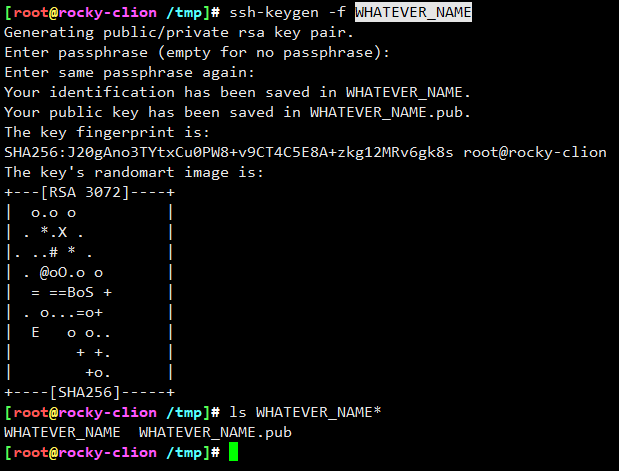
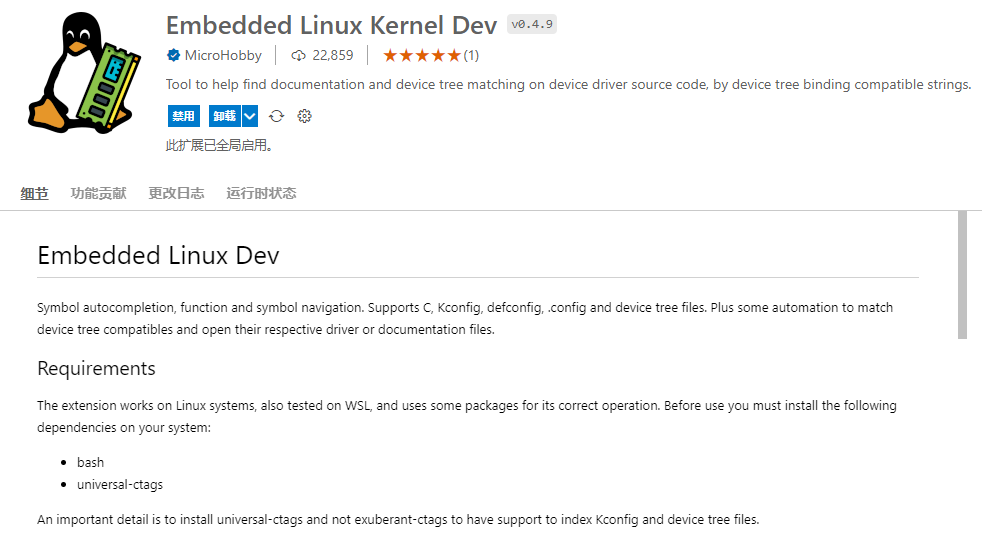
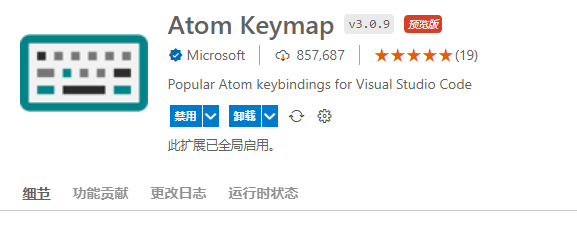
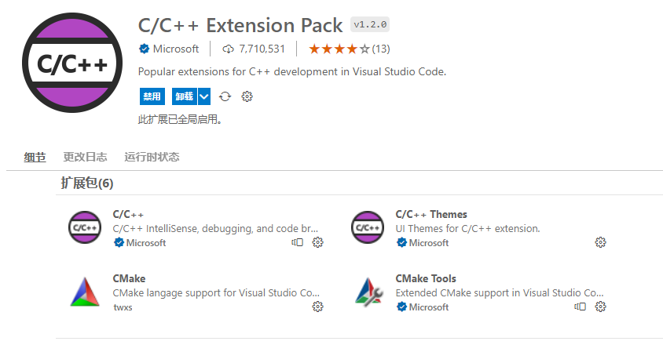
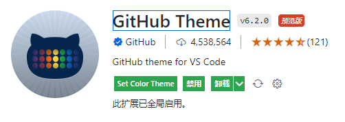
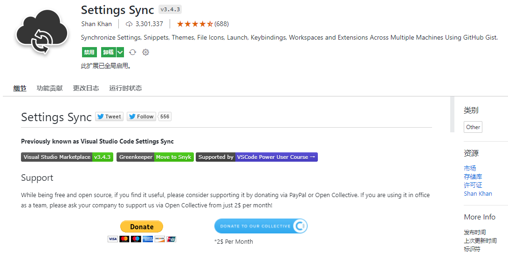
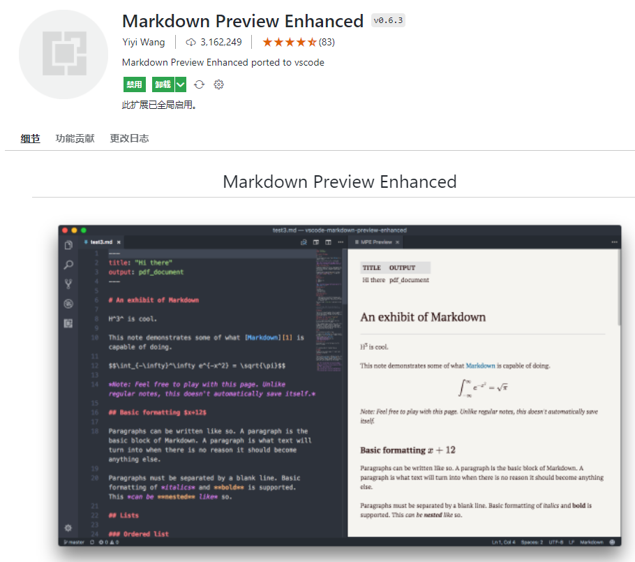
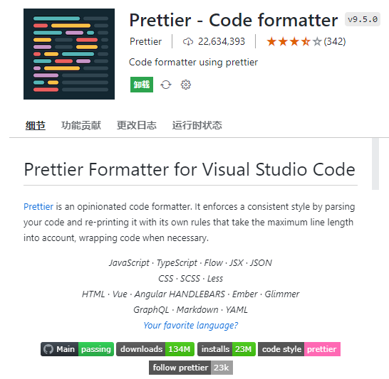

<!-- MDTOC maxdepth:6 firsth1:1 numbering:0 flatten:0 bullets:1 updateOnSave:1 -->

- [vscode](#vscode)   
   - [常用插件](#常用插件)   
      - [Remote-SSH](#remote-ssh)   
      - [Embeded Linux Kernel Dev(ELKD)](#embeded-linux-kernel-develkd)   
      - [Atom Keymap](#atom-keymap)   
      - [Chinese (Simplified) (简体中文) Language Pack for Visual Studio Code](#chinese-simplified-简体中文-language-pack-for-visual-studio-code)   
      - [C/C++ Extension Pack](#cc-extension-pack)   
      - [Bracket Pair Colorizer](#bracket-pair-colorizer)   
      - [GitHub Theme](#github-theme)   
      - [Settings Sync](#settings-sync)   
      - [Markdown Preview Enhanced](#markdown-preview-enhanced)   
      - [Prettier - Code formatter](#prettier-code-formatter)   
      - [LeetCode](#leetcode)   

<!-- /MDTOC -->

# vscode


## 常用插件

### Remote-SSH


不支持记住密码，因此99.9%免密采用公私钥方式

```
Host remotehost.yourcompany.com
    User yourname
    HostName another-host-fqdn-or-ip-goes-here
    IdentityFile ~/.ssh/WHATEVER_NAME
```

公私钥生成方式：

```
ssh-keygen -f WHATEVER_NAME
```



* 公钥拷贝到目标主机的authorized_keys中，对应用户家目录
* 私钥放与vscode所在机器的任意路径，只要能访问到。并填充**IdentityFile**到config文件

```
cat WHATEVER_NAME.pub >> ~/.ssh/authorized_keys
```

### Embeded Linux Kernel Dev(ELKD)



```
光标停在符号的位置，然后右击鼠标选择“转到定义”或者按F12，即可查看符号的定义或者直接跳到符号定义的所在文件中
```

### Atom Keymap



自行挑选习惯的快捷键

### Chinese (Simplified) (简体中文) Language Pack for Visual Studio Code


### C/C++ Extension Pack




### Bracket Pair Colorizer

可以让括号具有颜色的小功能插件，各个成对儿的括号都会以不同的颜色进行区别。


### GitHub Theme




### Settings Sync

只需一个 Github 账号就可以在不同的设备之间同步 VS Code 的设置、插件和主题等项目



### Markdown Preview Enhanced



### Prettier - Code formatter




### LeetCode


---
